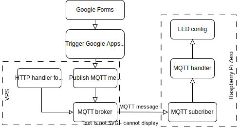

My friend and family are able to display their own messages by filling a [Google Forms](https://forms.gle/S8Wy22Y4KKhefGZC8).

# See the hat in action


# System block


- Google forms: https://forms.gle/S8Wy22Y4KKhefGZC8
- Google Apps Script: [code.gs](code.gs)
- VPS configurations: [MQTT broker](MQTTBroker)
- Raspbery Pi Zero configurations: [Raspberry Pi Zero](piZero)


##  Adafruit RGB Matrix Bonnet for Raspberry Pi 

- [Pinout](https://learn.adafruit.com/adafruit-rgb-matrix-bonnet-for-raspberry-pi/pinouts)
- Unused GPIO pins include: SCL, SDA, RX, TX, #25, MOSI, MISO, SCLK, CE0, CE1, #19. GPIO25 can be used to reset Raspberry PI

## 64x32 Flexible RGB LED Matrix - [4mm Pitch](https://www.adafruit.com/product/3826)

This panel is choosen because of its light weight comparing to other panels. It has 12 16-bit latches that allow you to drive the display with a 1:16 scan rate. These panels require 13 digital pins (6 bit data, 7 bit control) and a good 5V supply, up to 4A per panel.

## Install adafruit-rbg library

```bash
# https://github.com/autorope/donkeydocs/issues/27#issuecomment-1001816493
sudo apt-get update --allow-releaseinfo-change
sudo apt-get install libgraphicsmagick++-dev libwebp-dev -y

curl https://raw.githubusercontent.com/adafruit/Raspberry-Pi-Installer-Scripts/main/rgb-matrix.sh >rgb-matrix.sh
sudo bash rgb-matrix.sh
```

### Compile the sample project

Adafruit sells a board where they choose a different mapping. You can choose with the `--led-gpio-mapping` flag when running the sample project.
If you have a 64x32 display, you need to supply the flags `--led-cols=64 --led-rows=32` for instance. See more [here](https://learn.adafruit.com/adafruit-rgb-matrix-bonnet-for-raspberry-pi/driving-matrices)

```bash
# scrolling-text-example.cc
# scolling a text
cd examples-api-use
make
sudo ./scrolling-text-example --led-rows=32 --led-cols=64 --led-gpio-mapping=adafruit-hat -s 1 -f ../fonts/10x20.bdf "Hello World!!"

# image-example.cc
# display an image
make image-example
sudo ./image-example --led-rows=32 --led-cols=64 --led-gpio-mapping=adafruit-hat LinkedIn_32.jpg

# my main program
# display a text and an image
sudo ./main -f "tuyendl" -s "Open to work" -i LinkedIn_16.jpg
```

### Configure Raspberry Pi WiFi client

Since the WiFi in campus may be jammed, I need to setup a Hotspot from my Android phone and connect Raspberry Pi to it. Here is how it's been done.

```
vi /etc/wpa_supplicant/wpa_supplicant.conf

ctrl_interface=DIR=/var/run/wpa_supplicant GROUP=netdev
update_config=1

network={
    ssid="PiHat"
    psk="ayPf2tYm"
    scan_ssid=1
    proto=RSN
    key_mgmt=WPA-PSK
    pairwise=CCMP
    auth_alg=OPEN
    priority=2
}
```

cat /var/log/syslog | grep wpa_supplicant

```
# interfaces(5) file used by ifup(8) and ifdown(8)

# Please note that this file is written to be used with dhcpcd
# For static IP, consult /etc/dhcpcd.conf and 'man dhcpcd.conf'

# Include files from /etc/network/interfaces.d:
source-directory /etc/network/interfaces.d

auto wlan0
allow-hotplug wlan0
iface wlan0 inet dhcp
wpa-conf /etc/wpa_supplicant/wpa_supplicant.conf
iface default inet dhcp
```

# Development notes

## Some interesting classes/functions

- https://github.com/hzeller/rpi-rgb-led-matrix/tree/master/examples-api-use
- https://github.com/hzeller/rpi-rgb-led-matrix/blob/master/include/threaded-canvas-manipulator.h
- https://github.com/search?q=repo%3Ahzeller%2Frpi-rgb-led-matrix+thread&type=issues&p=10
- [Value categories (lvalues and rvalues)](https://www.learncpp.com/cpp-tutorial/value-categories-lvalues-and-rvalues/)
- [Emoji](https://www.reshot.com/free-svg-icons/item/emoji-icon-set-flat-JUGV8M6LFR/) and [emojipedia](https://emojipedia.org/people/)


## Thread

Monitor thread and its children

```bash
export PID=1829
htop -p `pstree -p $PID | perl -ne 'push @t, /\((\d+)\)/g; END { print join ",", @t }'`
```

Some comments from **rpi-rgb-led-matrix** repository are followed.

[Multi thread safe](https://github.com/hzeller/rpi-rgb-led-matrix/issues/1494#issuecomment-1368440225)

I would not recommend using multiple threads to update the currently active canvas. Setting a pixel requires multiple writes internally and it can not be protected by a mutex, as it would interrupt the thread constantly refreshing the display.

Instead, make the granularity of updates for a full frame. This is commonly used as well in regular graphics to avoid tearing.

Create an off-screen canvas, fill it with the next frame and then `SwapOnVSync()` that in. That way, you will not have any glitches or tearing. Also, you don't need multiple threads to update the content, you can prepare the entire next frame of your animation in the main thread (draw the clock, draw the weather data, write the text to the next scroll position). Simplifies the code a lot.

You also will have exact timing as the `SwapOnVSync()` changes the off-screen canvas atomically when switching to the next frame.

This is true for C and Python (in particular Python, as that is way slower and thus emphasizes glitches)

---

> How to make a thread that can change the data it displays. #1135

You do not want a start/stop matrix here. Your goal here is more related to how to deal with the thread.

If you want to have a text and replace it later, you should have exactly one thread, that you then pass a new text. Don't let loose of the thread, you need a reference to it to pass some data (ideally, you use a thread abstraction like the one provided in this project - that way, you have an object you can more easily abstract the passing data part).

Your goal is to run the thread and tell it when to show something different. You typically would do that by having a method on your thread SetNewText(std::string s) of sorts, which manipulates an instance variable. Inside the Run() method, you'd check with every loop if that text changed and do whatever is necessary to switch to the new display.

You must use a mutex for passing the thread boundary of course.

In the ThreadedCanvasManipulator you see an example how to pass some data safely with a mutex; in this case it is a running flag, but you'd do something similar. See more [here](https://github.com/hzeller/rpi-rgb-led-matrix/blob/master/include/threaded-canvas-manipulator.h)


## `tmux` configuration

In order to keep Raspberry Pi running even when the SSH connection is dropped, **tmux** is needed to keep the session alive.

```bash
# Create a new session
tmux new -s hat
# List all active session
tmux ls

# attach to session
tmux a
# attach to 'hat' session
tmux a -t hat
```

```
mqtt-python/reset.sh
```
 